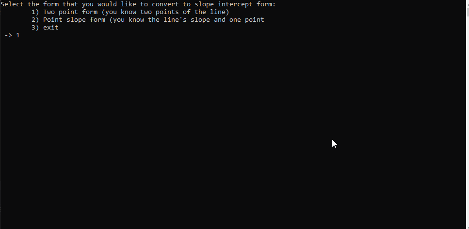

# Slope-Intercept
This project is a GUI line graphing application. It is built in C++ using the OpenGL Library. The program is able to 
dynamically create a user interface displaying a graph with a line whose properties are based on user input. The program also calculates equatations based on the property of the line and displays it to the user.
This project was my final project for my Programming Methodologies course (COP 2001).

# Features
- Can accept one point and a slope from the user to create a line.
- Can accept two points from the user to construct a line.
- Calculates point-intercept and slope-intercept equations for the line to display.

# Demo

